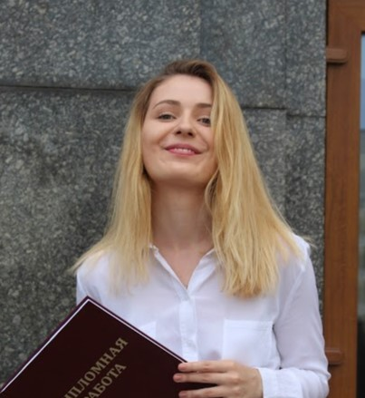
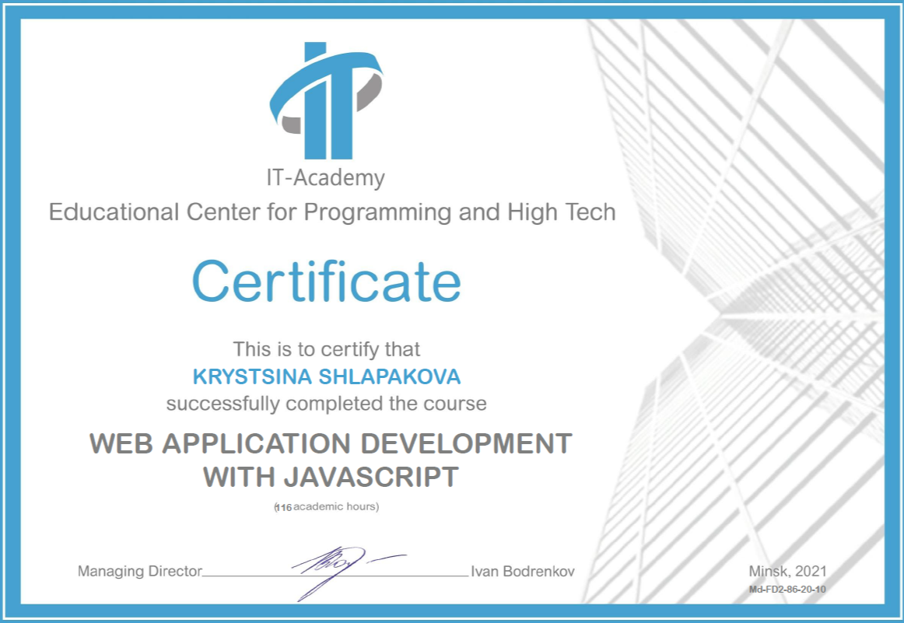

# Krystsina Shlapakova



- <shlapakova.kristina@gmail.com>
- +48507926340
- Warsaw, Poland

>About myself

>I have a solid educational background in Computer Mathematics and System Analysis, complemented by practical experience in pharmacy and customer service roles. Seeking opportunities in front-end or full-stack development roles where I can leverage my technical skills and passion for web application development.


## Education

1. ### Belarusian State University, Minsk, 2013 - 2017
 Computer Mathematics and System Analysis
 - Programming: C++, UML, HTML, CSS, JavaScript, MySQL, Java.
 - Technologies: Rational Rose; Enterprise Architect; Eclipse; Wolfram Mathematica; Matlab; IntelliJ IDEA; SceneBuilder.
 - Subjects: Linear algebra, system analysis, business analysis, differential equations, geometry, probability theory, statistics.

2. ### School GoWork, IT specialist, Warsaw, 2017 - 2019

3. ### IT-Academy, Minsk, Belarus, 2021
Web Application Development with JavaScript



3. ### SKK Warsaw, 2020 - 2023
Pharmacy Technician

4. ### Association of Accountants in Warsaw, 2023

## Experience

#### Teacher, Belarusian State University, 2016-2017

Higher Maths for senior high school student, preparing for the Olympiads.

#### Sys Admin, Minsk, 2017

Keeping a website content up to date; 
regular website maintenance. (WordPress, Adobe Photoshop; HTML, JavaScript)

#### Administrator, Warsaw, 2018-2019
Clothes Store Colin's Collection, Managed administrative tasks and assisted customers with their queries.

#### Support, Online Store, 2021
Assisted customers with their online orders and resolved any issues.

#### Accounting Assistant, Ipso Finanse, Warsaw, Poland (2023)
Assisted in various accounting tasks and maintained financial records.

#### Pharmacy Technician, Apteka DOZ, Warsaw, Poland (2023-present)
Selling medications and compounding prescription drugs


### Example of my code that converts Kelvin to Celsius and then to Fahrenheit for CODEACADEMY task: 

```javascript 
const kelvin = 0; // temperature in kelvin
let celsius = kelvin - 273; // temperature in celsius;
let fahrenheit = celsius * (9 / 5) + 32; // temperature in fahrenheit; 
fahrenheit = Math.floor(fahrenheit); // round down the fahrenheit temperature;
console.log(The temperature is ${fahrenheit} degrees Fahrenheit.);
```
| Language |    Level  |
| ------------- |:-------------:|
| Russian       | native        |
| Polish        | intermediate  |
| English       | intermediate  |
